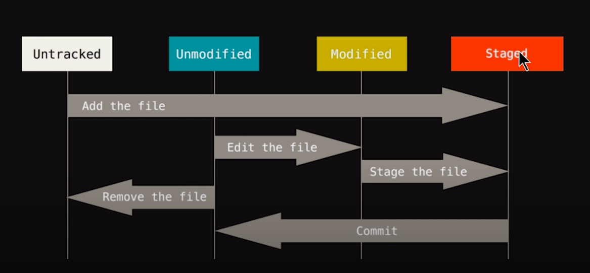

### Install Ubantu

```bash
sudo apt-get install git -y
```
### Check Version

```bash
git --version
```

### Set Globaly
```bash
git config --global user.name AhmadAliCodility
git config --global user.email ahmed.ali@codilitysolutions.com

git config --list
    user.email=ahmed.ali@codilitysolutions.com
    user.name=AhmadAliCodility

```
### Initialize GIT

```bash
git init
```
### Show all hidden folders
```
ls -lart
total 16
drwxr-xr-x 3 lap-066 lap-066 4096 جون    16 10:45  ..
-rw-rw-r-- 1 lap-066 lap-066  383 جون    16 10:57 'git commands.md'
drwxrwxr-x 3 lap-066 lap-066 4096 جون    16 10:58  .
drwxrwxr-x 7 lap-066 lap-066 4096 جون    16 10:58  .git

```
### Git Status

```bash
git status

On branch master

No commits yet

Untracked files:
  (use "git add <file>..." to include in what will be committed)
	git commands.md
	index.html

nothing added to commit but untracked files present (use "git add" to track)

```



### Add to staging Area and check Status

```bash
git add index.html

git status
On branch master

No commits yet

Changes to be committed:
  (use "git rm --cached <file>..." to unstage)
	new file:   index.html

Untracked files:
  (use "git add <file>..." to include in what will be committed)
	git commands.md
	screenshot.png

```

### Commit
```bash
git commit -m "First commit"
```

### Checkout 
1. if some one change your file by mistake then this commandd will help you to recover your code back it  match with last commited file
2. I change on the index file and save it now i run this command to back my code

```bash
git checkout index.html
```
1. If Someone change all of your files and in Git status you found all files modified  then this command will help you to back to your last commit

Match with your previous commit and recover your file
```bash
git checkout -f
```

### GIT LOG
All of Your Commit Logs

```bash
git log
commit d07e04aeb7f5ff95cceec19795d90867635de136 (HEAD -> master)
Author: AhmadAliCodility <ahmed.ali@codilitysolutions.com>
Date:   Wed Jun 16 11:43:08 2021 +0500

    Markdown

commit 5fa9e4da5e41edab300a238cf703c06919630bc9
Author: AhmadAliCodility <ahmed.ali@codilitysolutions.com>
Date:   Wed Jun 16 11:23:16 2021 +0500

    second commit

commit 5512b6397f869c494dad95111beb29e01089478f
Author: AhmadAliCodility <ahmed.ali@codilitysolutions.com>
Date:   Wed Jun 16 11:16:46 2021 +0500

    Initial Commit

``` 

If you commited many files and you want to see some/last files then you use this command
`-1 means last 1 file`
```bash
git log -p -1
```

### GIT Difference
1. comapare working tree with staging area

```bash
git diff
```

1. comapare staging area with last commit

```bash
git diff --staged
```
### Skipped Staging Area

```bash
git commit -a -m "Skiped Staging Area"
```
### Remove File

1. Remove file from computer and staging area
```bash
git rm waste.html
```
1. Remove File only from stagging area

```bash
git rm --cached waste.html

git status
On branch master
Changes to be committed:
  (use "git restore --staged <file>..." to unstage)
        deleted:    waste.html

Untracked files:
  (use "git add <file>..." to include in what will be committed)
        waste.html
```
### Branching

1. Create a new Branch<br>`git branch branchname`
2. Check Branches<br> `git branch `
3. Switch branches<br> `git checkout  branchname`
4. Create and already switch to that branch <br> `git checkout -b branchname`
5. 

